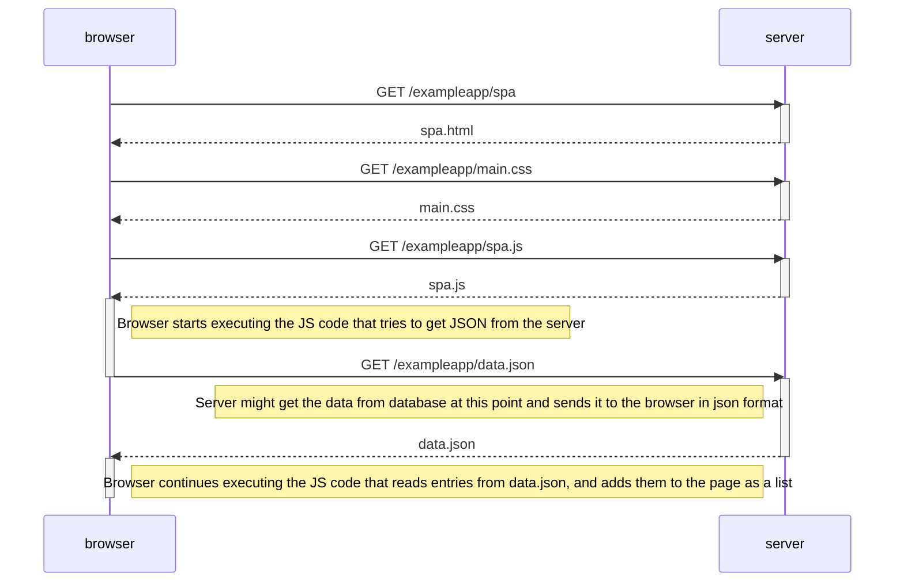

Single page app diagram

```mermaid
sequenceDiagram
    participant browser
    participant server

    browser->>server: GET /exampleapp/spa
    activate server
    server-->>browser: spa.html
    deactivate server

    browser->>server: GET /exampleapp/main.css
    activate server
    server-->>browser: main.css
    deactivate server

    browser->>server: GET /exampleapp/spa.js
    activate server
    server-->>browser: spa.js
    deactivate server
    activate browser
    Note right of browser: Browser starts executing the JS code that tries to get JSON from the server

    browser->>server: GET /exampleapp/data.json
    deactivate browser
    activate server
    Note left of server: Server might get the data from database at this point and sends it to the browser in json format
    server-->>browser: data.json
    deactivate server

    activate browser
    Note right of browser: Browser continues executing the JS code that reads entries from data.json, and adds them to the page as a list
    deactivate browser

```
