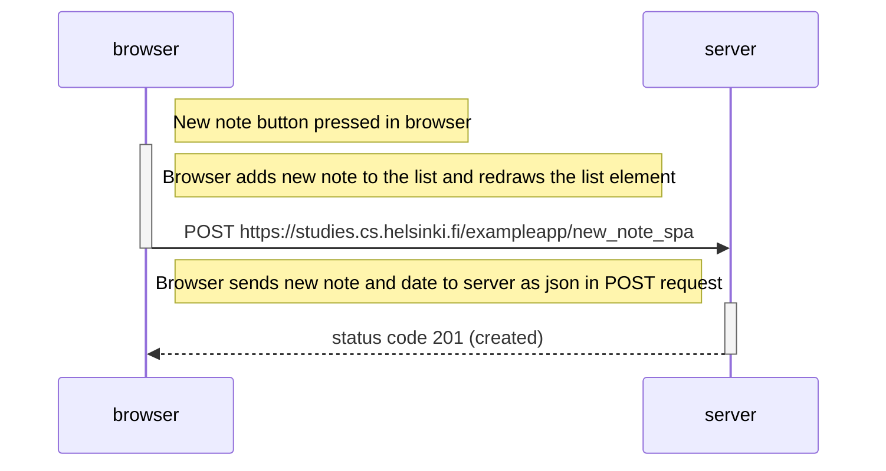

New note in spa

```mermaid
sequenceDiagram
    participant browser
    participant server

    Note right of browser: New note button pressed in browser
    activate browser
    Note right of browser: Browser adds new note to the list and redraws the list element

    browser->>server: POST 	https://studies.cs.helsinki.fi/exampleapp/new_note_spa
    deactivate browser
    Note right of browser: Browser sends new note and date to server as json in POST request
    activate server
    server-->>browser: status code 201 (created)
    deactivate server

```
